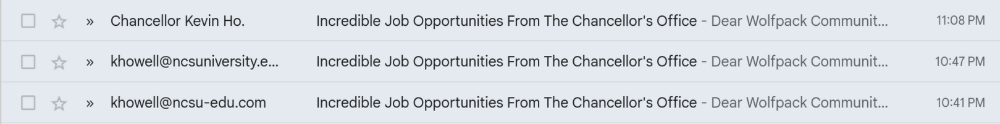
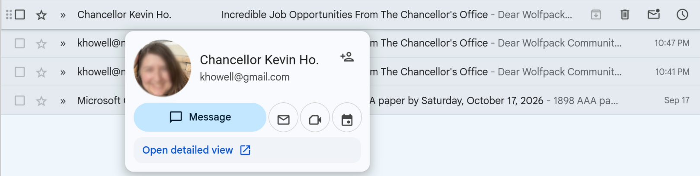
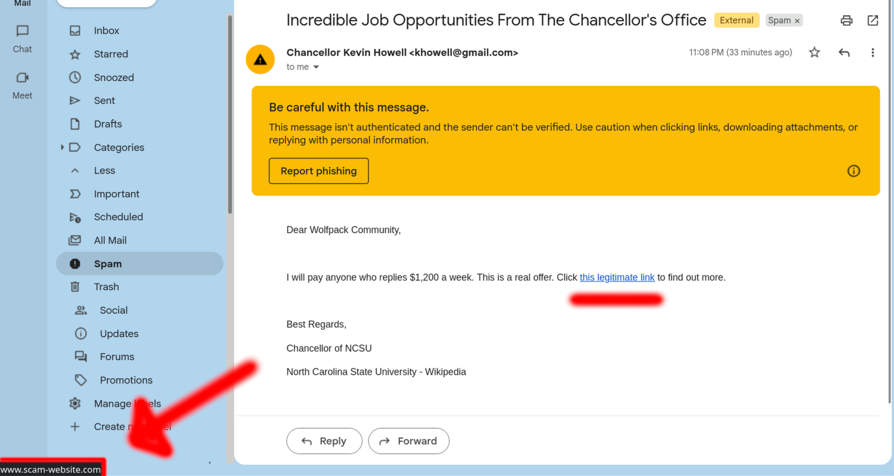

# Recognizing Phishing Emails

Phishing scams try to trick you into providing criminals with money or private information. By combining your private information like passwords or answers to security questions with publicly available information about you, criminals can steal your identity and cause a lot of trouble. For example, they could open new credit cards, take out loans, purchase expensive items, or even receive medical care in your name.[^1] Criminals might also sell your information and target your friends, family, and other people you know.

<!-- good introduction that sets the scene for why this topic is worthy of attention. Maybe the last sentence could go. -->

Phishing emails masquerade as messages from legitimate organizations or people. These emails may include incredible job offers or demands that you update your payment information for an online service. Criminals hope that you will be too surprised or upset to notice that the links in these emails are to harmful (yet often real-looking) websites that steal any information you provide.

Fortunately, phishing emails often have several clues that can help you identify when someone is trying to trick you. Here's how you can stay safe.

## Check the Sender

Check the sender or the "from" field in your email client. Although phishing emails may appear to come from legitimate sources, the sender domain (the part after the @ symbol) is often fake. For example, all three of the emails in figure 1 are fake, although one appears more legitimate.

 **Figure 1**. *Two obviously fake senders (bottom) and one that appears legitimate (top).*

Fake domains usually contain misspellings or extra elements, such as "ncsu-edu.com" rather than "ncsu.edu", as in the image; "microsoft-usa.com" rather than "microsoft.com", or "netf1ix.com" rather than "netflix.com". And sometimes attackers use personal email domains like "gmail.com" rather than official domains, hoping you don't notice (as in figure 2). Don't expect our chancellor to contact you via a gmail.com address with the wrong photo!

<!-- Although the procedures, so far, have more writing than I would anticipate students to read, the tone is personable and humorous, so maybe the amount of words and the manner of the delivery offset one another -->

 **Figure 2**. *Hovering over the top sender reveals that the email was sent from a personal rather than official address.*

## Check the Subject and Skim the Email

<!-- I appreciate how the headings are, by themselves, a minimalist form of documentation. One could just read the headings and have enough information -->

Check the subject line, skim the email, and ask yourself some quick questions:

- Am I expecting this person to message me about this topic?

  - The chancellor's office, for example, doesn't usually offer jobs to students via email.

- Are they demanding I do something quickly or making an offer that seems too good to be true?

  - Even if something seems urgent, like a company notifying you that your account is about to be deleted, it's OK to think for a minute or two before deciding whether to respond. Criminals hope to surprise or upset you so that you act without thinking first.

## Check the Links

The destination of a link—where it takes you when you click—and the text or image of the link itself can be vastly different, as figure 3 demonstrates.

 **Figure 3**. *Although the link proclaims to be legitimate, it directs you to a scam website.*

<!-- funny sample message. Good use of image annotation to draw attention to the relevant instructional information -->

Hover your mouse over a link to see the destination; depending on your web browser, the destination may appear as a pop-up or in the corner of your screen. Don't click the link if you don't recognize the destination or if it seems suspicious, such as the example in the image or something like an Instagram email with the destination "instagram-accounts.com" rather than "instagram.com".

## Ask for Help

If you think the email is legitimate, consider contacting the sender directly to ask. Instead of replying to the email, however, use your address book, [the campus directory](https://directory.ncsu.edu/), or the business's official website to get the correct contact info. For example, rather than replying to a suspicious email from your bank, go to your bank's website and use the contact info there.

If you're not so sure about the email, you can consult with the NC State Help Desk by using the [campus IT service portal](https://help.ncsu.edu/) or calling 919-515-HELP (4357). You can also forward suspicious emails to [phishing@ncsu.edu](mailto:phishing@ncsu.edu).[^2]

If you think that you have already provided sensitive information to a scammer, such as by following a link to "confirm your payment details" or "authorize your account", then you should immediately follow these steps to secure your accounts: <!-- maybe this kind of "recovery" information could us its own heading? I could see a user wanting to find recovery information directly. Although the recovery information is implied under a heading like "Ask for Help," making that association does require some interpretation --> 

- Reset your password for the affected service or account. Additionally, if the scam involved banking or payment information, contact your bank for further instructions. Although it may be embarrassing to report that your information has been stolen, your bank or credit card provider can't help you unless you tell them what has happened.
- Reset your email password. You can reset your university email password [here](https://selfserviceidm.ncsu.edu/SSPW/pwdchangeform.htm).
- Contact the NC State Help Desk to report the email. Again, although you might feel embarrassed, know that IT staff will likely be grateful that you proactively reached out to them to resolve the problem.

## Disengage

Phishing emails can ruin a lot more than your day, but thankfully the safest option is usually the easiest when dealing with these potential threats: disengage. If you've checked the sender, checked the links, and asked for help but you're still unsure, then ignoring the email is often the best option. If something is important and legitimate, the sender can likely contact you in person, via your phone, or with a follow-up email.

[^1]: Allstate Identity Protection. (2026, March 31). *Guess what scammers can do with the most basic info*. [https://www.allstateidentityprotection.com/content-hub/how-scammers-use-your-personal-information](https://www.allstateidentityprotection.com/content-hub/how-scammers-use-your-personal-information)

[^2]: Sutton, Chelsea. (2025, January 15). *Be a wolf, not a phish: Three tips to avoid phishing scams*. NCSU Office of Information Technology. [https://oit.ncsu.edu/2025/01/15/think-before-you-click-three-tips-to-avoid-phishing-scams/](https://oit.ncsu.edu/2025/01/15/think-before-you-click-three-tips-to-avoid-phishing-scams/)
